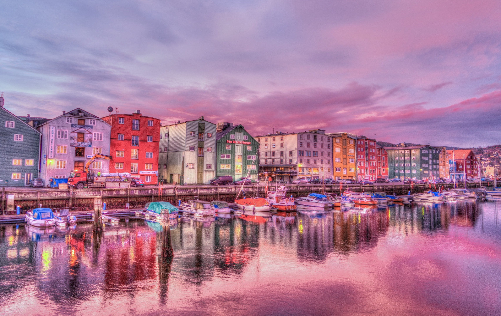
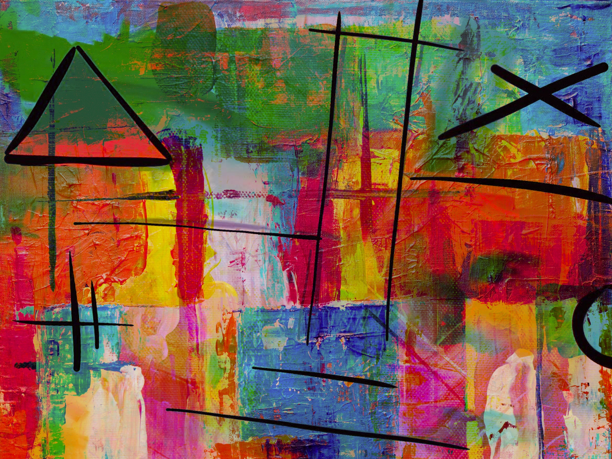

# Style transfer bot
 
The bot is available at: https://t.me/style_transfer_fast_bot

This bot can transfer style from one (style) image to another (content) image.

## Usage
1. Use /transfer.
2. Send your content image as photo or a document (document size must not be bigger than 8 MB (currently, as it is running on 12 GB GPU)), or you can choose from provided examples.
3. Send style image or choose on of the examples the same way as content image.
4. You can choose the degree of stylization and the model. Bot will provide you more detailed info on this settings.
5. Click 'Generate!'.
6. After about 1 second bot will send you a document with generated image.

### Examples
Content image: 

Style image: 

Generated image: 

## Installation
If you want to use this code for your own bot, follow this steps:

1. `git clone https://github.com/irtez/Style-transfer-bot.git`
2. Create .env file in bot/app/
3. Specify TOKEN and OWNER_ID in bot/app/.env. You can create and get bot token with https://t.me/BotFather and check your account Telegram ID with https://t.me/getmyid_bot.
4. Make sure you have Docker and docker-compose installed and compatible with docker-compose version 3.8.
5. In terminal change work directory to Style-transfer-bot (`cd Style-transfer-bot`).
6. `docker-compose up`
7. Your bot should be running at https://t.me/<your_bot_name>

### Additional information
For now, bot uses 2 MicroAST models (https://github.com/EndyWon/MicroAST).
"old" model uses weights from official repo, "new" was trained with increased style and SSC losses coefficients.
In model/app/config you can change new_folder to "185k_sigmoid", that weights were obtained by training the model extra 25k iterations with using sigmoid after last decoder layer output. It was a try to make alpha (style degree) work better, as for now when alpha != 1.0 both models output values are far from range [0, 1] and are adjusted in postprocessing, resulting in bad image quality. However, this didn't work (model output were very close to 0 and generated image was very dark, nearly black), but the "185k_sigmoid" weights are ok and you can still try using them with alpha = 1.0 (100%).
 
Containers communicate in shared_network as configured in compose.yaml, so containers' ports are not mapped to host ports. If you want to use them in any external apps, you can do it by mapping `<your_port>:80` in model and `<your_port>:6379` in redis container settings.

With release of https://github.com/Sooyyoungg/AesFA code I will try to replace "new" model with this architecture.
